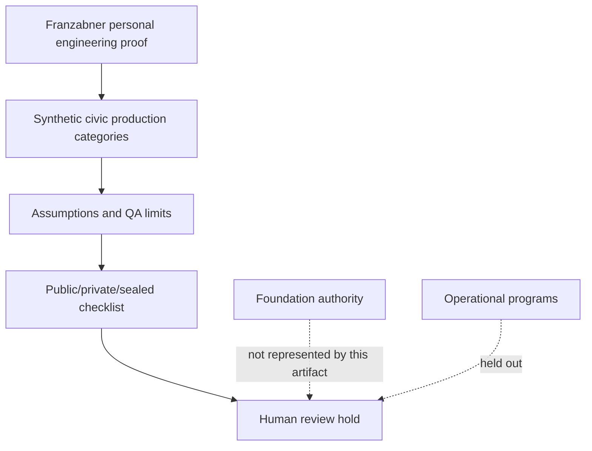

# Personal Engineering Civic Production Boundary

Status: scaffolded

## Problem Statement

Create a public-safe synthetic artifact that explains the boundary between Franzabner personal engineering proof and Foundation-adjacent civic production topics without speaking as the Foundation, implying operational Foundation programs, or claiming deployment, manufacturing readiness, certified safety, or proof completion.

## Synthetic Civic Production Context

The context is a generic civic infrastructure production study surface. It may describe public-safe categories such as recycling automation studies, 3D-print workflow notes, recycled-material part templates, QA assumptions, material-flow review, civic-node hardware context, school infrastructure boundary notes, disaster-resilient production boundaries, dashboard notes, workflow notes, and synthetic data-logging notes.

It must not describe a school deployment, production recycling line, live civic node deployment, disaster-response deployment, manufacturing readiness, private facility layout, live operations, or Foundation-private data.

## Foundation-Adjacent Boundary

This artifact may reference civic infrastructure as a domain. It does not speak as the Foundation, define Foundation authority, claim Foundation operations, use donor data, use student data, use volunteer data, or include Foundation-private data.

Foundation-adjacent here means only that the study domain concerns civic infrastructure categories. The authority remains personal engineering documentation under Franzabner until a separate human-reviewed process says otherwise.

## Personal Proof-Surface Boundary

The artifact documents personal engineering reasoning and public-safe review discipline only. It is not a Foundation program plan, production deployment record, field operations guide, manufacturing package, certified safety file, or proof-complete artifact.

## Production Workflow Categories

| Category | Public-safe scope | Held boundary |
| --- | --- | --- |
| Recycling automation studies | Generic line-stage reasoning and QA questions | No production recycling line or live operations |
| 3D-print production workflows | Generic process and review checkpoints | No production CAD, exact dimensions, or manufacturing readiness |
| Recycled-material infrastructure parts | Study templates and proof-limit language | No sealed designs or sealed geometry |
| Civic-node hardware context | Boundary notes for hardware categories | No live civic node deployment |
| School infrastructure systems | Boundary notes for review questions | No school deployment or student data |
| Disaster-resilient production | Resilience categories and review holds | No disaster-response deployment |
| Dashboard and workflow notes | Generic documentation categories | No live operations or credentials |
| Data-logging notes | Synthetic Postgres/Qdrant/MinIO categories | No customer data or Foundation-private data |

## Assumptions Table

| Assumption | Synthetic value | Boundary note |
| --- | --- | --- |
| Production workflow | Generic civic workflow category | Not a live operation |
| Throughput | Example qualitative class | Not a private measurement |
| QA state | Review hold | Not certified safety |
| Facility context | Public-safe abstract setting | Not a private facility |
| Public role | Personal engineering proof surface | Does not speak as the Foundation |
| Data posture | Synthetic metadata only | No donor data, student data, volunteer data, or customer data |

## Safety And QA Limits

Safety and QA material in this artifact is non-certified and review-oriented. It may define review questions, hold states, and public/private/sealed checks, but it must not claim certified safety, deployment readiness, manufacturing readiness, physical validation, operational Foundation program status, or live production use.

QA limits are scoped to documentation review:

- Check that the artifact uses synthetic assumptions only.
- Check that Foundation-adjacent language does not become Foundation voice.
- Check that no donor, student, volunteer, customer, or Foundation-private data appears.
- Check that no production CAD, production schematics, BOMs, Gerbers, exact dimensions, sealed designs, or sealed geometry appears.
- Check that no school deployment, production recycling line, live civic node, disaster-response deployment, or manufacturing readiness claim appears.

## Mermaid Civic Boundary Diagram

## Validation Questions

- Does the artifact remain Franzabner personal engineering proof rather than Foundation voice?
- Does the artifact avoid operational Foundation program, school deployment, production recycling line, live civic node, disaster-response deployment, manufacturing readiness, certified safety, and proof-completion claims?
- Does the artifact avoid donor data, student data, volunteer data, Foundation-private data, customer data, private sites, private facility layouts, private measurements, and live operations?
- Does the artifact avoid production CAD, production schematics, BOMs, Gerbers, exact dimensions, sealed designs, and sealed geometry?
- Are public/private/sealed boundaries visible before any public creation or routing step?

## What This Proves

- A public-safe structure for separating civic production study categories from Foundation authority.
- A reviewable pattern for assumptions, QA limits, boundary checks, and proof-limit language.
- A local scaffold suitable for human review before public creation.

## What This Does Not Prove

- It does not prove Foundation operations, school deployment, production recycling line readiness, live civic node deployment, disaster-response deployment, manufacturing readiness, certified safety, physical validation, or proof completion.
- It does not document a private facility, live operation, production design, customer system, donor record, student record, volunteer record, or Foundation-private system.
- It does not release a public artifact or complete proof-stack routing.

## Public / Private / Sealed Checklist

| Boundary item | Status |
| --- | --- |
| Synthetic assumptions only | yes |
| Franzabner personal proof-surface boundary stated | yes |
| Foundation voice avoided | yes |
| Operational Foundation program claims absent | yes |
| Donor/student/volunteer data absent | yes |
| Customer data absent | yes |
| Foundation-private data absent | yes |
| Private measurements absent | yes |
| Production CAD absent | yes |
| Production schematics absent | yes |
| BOMs and Gerbers absent | yes |
| Exact dimensions absent | yes |
| Live operations absent | yes |
| Private sites and private facility layouts absent | yes |
| Internal company product names absent | yes |
| Sealed designs and sealed geometry absent | yes |
| Release claim absent | yes |
| Proof-completion claim absent | yes |

## Boundary

This scaffold is not released, not published, and not proof-complete.
